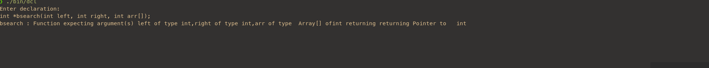

#																									dcl
## Get a description in words of the entered C declaration

# Making and running the code

* Run the make command from the root directory
* The executable will be stored in the bin directory
* Run the executable by running ./bin/dcl 
* EOF exits from the program

Examples:

